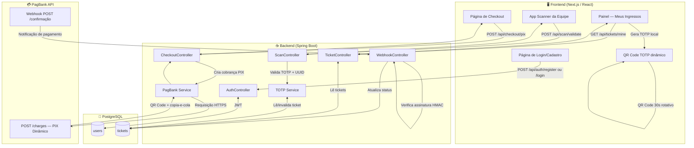

# Arquitetura Técnica — Sistema de Venda e Validação de Ingressos

> **Stack:** Next.js · Spring Boot · PostgreSQL · PagBank PIX

---

## 1. Diagrama de Arquitetura (Mermaid)



---

## 2. Modelagem do Banco de Dados (PostgreSQL)

### Tabela: `users`

```sql
CREATE TABLE users (
    id            UUID PRIMARY KEY DEFAULT gen_random_uuid(),
    full_name     VARCHAR(150)  NOT NULL,
    email         VARCHAR(255)  NOT NULL UNIQUE,
    password_hash VARCHAR(255)  NOT NULL,  -- BCrypt
    created_at    TIMESTAMPTZ   NOT NULL DEFAULT NOW(),
    updated_at    TIMESTAMPTZ   NOT NULL DEFAULT NOW()
);

CREATE INDEX idx_users_email ON users (email);
```

### Tabela: `tickets`

```sql
CREATE TABLE tickets (
    id               UUID PRIMARY KEY DEFAULT gen_random_uuid(),

    -- Chave estrangeira para o comprador
    user_id          UUID NOT NULL REFERENCES users(id) ON DELETE CASCADE,

    -- Controle de pagamento (PagBank)
    pagbank_order_id VARCHAR(100) UNIQUE,
    payment_status   VARCHAR(30) NOT NULL DEFAULT 'PENDING',
    --   PENDING | PAID | CANCELLED | REFUNDED

    -- Dados do ingresso
    ticket_uuid      UUID NOT NULL UNIQUE DEFAULT gen_random_uuid(),

    -- Segurança TOTP (QR Code Dinâmico)
    totp_secret      VARCHAR(100) NOT NULL,
    --   Chave Base32 gerada no backend após confirmação do pagamento

    -- Controle de acesso no evento
    is_used          BOOLEAN NOT NULL DEFAULT FALSE,
    used_at          TIMESTAMPTZ,
    used_by_staff    VARCHAR(100),

    -- Auditoria
    created_at       TIMESTAMPTZ NOT NULL DEFAULT NOW(),
    updated_at       TIMESTAMPTZ NOT NULL DEFAULT NOW()
);

CREATE INDEX idx_tickets_user_id       ON tickets (user_id);
CREATE INDEX idx_tickets_pagbank_order ON tickets (pagbank_order_id);
CREATE UNIQUE INDEX idx_tickets_uuid   ON tickets (ticket_uuid);
```

---

## 3. Contrato da API (Spring Boot)

### 3.1 Autenticação

| Método | Endpoint | Descrição | Auth |
|--------|----------|-----------|------|
| POST | `/api/auth/register` | Cadastro. Body: `{ name, email, password }` | Público |
| POST | `/api/auth/login` | Login. Retorna JWT. | Público |
| GET | `/api/auth/me` | Dados do usuário autenticado. | JWT |

### 3.2 Checkout & PIX

| Método | Endpoint | Descrição | Auth |
|--------|----------|-----------|------|
| POST | `/api/checkout/pix` | Inicia cobrança PIX. Retorna QR Code + copia-e-cola. | JWT |
| GET | `/api/checkout/status/{orderId}` | Consulta status do pagamento. | JWT |

### 3.3 Meus Ingressos

| Método | Endpoint | Descrição | Auth |
|--------|----------|-----------|------|
| GET | `/api/tickets/mine` | Lista ingressos PAID do usuário logado. | JWT |
| GET | `/api/tickets/{ticketUuid}/totp-seed` | Retorna semente TOTP para geração local do QR. | JWT |

### 3.4 Webhook

| Método | Endpoint | Descrição | Auth |
|--------|----------|-----------|------|
| POST | `/api/webhooks/pagbank` | Recebe notificação do PagBank. Valida HMAC. | Público (HMAC) |

### 3.5 Scanner da Equipe

| Método | Endpoint | Descrição | Auth |
|--------|----------|-----------|------|
| POST | `/api/scan/validate` | Valida `{ ticketUuid, totpToken }`. Marca ingresso como usado. | JWT (Staff) |

#### Exemplo de Response — Validação

```json
// 200 OK — Sucesso
{ "valid": true, "message": "Ingresso validado com sucesso.", "holderName": "João da Silva", "usedAt": "2025-10-15T20:14:33Z" }

// 409 Conflict — Já usado
{ "valid": false, "message": "Ingresso já utilizado.", "usedAt": "2025-10-15T19:50:10Z" }
```

---

## 4. Lógica do Webhook (PagBank)

### WebhookController.java

```java
@RestController
@RequestMapping("/api/webhooks")
public class WebhookController {

    @Autowired private TicketRepository ticketRepo;
    @Autowired private TotpService      totpService;
    @Value("${pagbank.webhook.secret}") private String webhookSecret;

    @PostMapping("/pagbank")
    public ResponseEntity<Void> handle(
            @RequestBody  String rawBody,
            @RequestHeader("X-PagBank-Signature") String signature) {

        // 1. Validar assinatura HMAC-SHA256
        if (!isValidSignature(rawBody, signature, webhookSecret)) {
            return ResponseEntity.status(401).build();
        }

        // 2. Deserializar payload
        PagBankWebhookPayload payload = parsePayload(rawBody);
        String orderId = payload.getReference_id();
        String status  = payload.getCharges().get(0).getStatus(); // "PAID"

        // 3. Buscar ticket
        Ticket ticket = ticketRepo.findByPagbankOrderId(orderId).orElse(null);
        if (ticket == null) return ResponseEntity.ok().build();

        // 4. Idempotência: já processado?
        if ("PAID".equals(ticket.getPaymentStatus())) {
            return ResponseEntity.ok().build();
        }

        // 5. Processar pagamento confirmado
        if ("PAID".equals(status)) {
            ticket.setPaymentStatus("PAID");
            ticket.setTotpSecret(totpService.generateSecret());
            ticket.setUpdatedAt(Instant.now());
            ticketRepo.save(ticket);
        }

        return ResponseEntity.ok().build();
    }

    private boolean isValidSignature(String body, String sig, String secret) {
        try {
            Mac mac = Mac.getInstance("HmacSHA256");
            mac.init(new SecretKeySpec(secret.getBytes(UTF_8), "HmacSHA256"));
            String computed = Hex.encodeHexString(mac.doFinal(body.getBytes(UTF_8)));
            return MessageDigest.isEqual(computed.getBytes(), sig.getBytes());
        } catch (Exception e) { return false; }
    }
}
```

### Tabela de Idempotência

| Cenário | Condição | Ação |
|---------|----------|------|
| 1ª entrega | `ticket.status = PENDING` | Processa: define PAID + gera TOTP |
| Duplicata | `ticket.status = PAID` | Ignora: retorna 200 |
| Desconhecido | `ticket = null` | Ignora: retorna 200 |
| Assinatura inválida | HMAC diverge | Rejeita: retorna 401 |

---

## 5. QR Code TOTP Dinâmico

### Frontend — Hook React (TypeScript)

```typescript
// hooks/useTotpQr.ts
import { totp } from 'otplib';
import { useEffect, useState } from 'react';

export function useTotpQr(ticketUuid: string, totpSecret: string) {
  const [qrValue, setQrValue] = useState('');

  useEffect(() => {
    const generate = () => {
      const token = totp.generate(totpSecret);
      setQrValue(`${ticketUuid}:${token}`);
    };

    generate();

    const now       = Math.floor(Date.now() / 1000);
    const remaining = 30 - (now % 30);
    const timeout   = setTimeout(() => {
      generate();
      const interval = setInterval(generate, 30_000);
      return () => clearInterval(interval);
    }, remaining * 1000);

    return () => clearTimeout(timeout);
  }, [ticketUuid, totpSecret]);

  return qrValue;
}
```

### Backend — TotpService.java

```java
@Service
public class TotpService {

    private final CodeVerifier verifier = new DefaultCodeVerifier(
        new DefaultCodeGenerator(), new SystemTimeProvider()
    );

    public String generateSecret() {
        return new DefaultSecretGenerator(32).generate();
    }

    public boolean validate(String secret, String token) {
        ((DefaultCodeVerifier) verifier).setAllowedTimePeriodDiscrepancy(1);
        return verifier.isValidCode(secret, token);
    }
}
```

---

## 6. Configuração de Variáveis de Ambiente

### .env.example

```env
# Database (PostgreSQL)
SPRING_DATASOURCE_URL=jdbc:postgresql://localhost:5432/ingressos_db
SPRING_DATASOURCE_USERNAME=ingressos_user
SPRING_DATASOURCE_PASSWORD=senha_super_segura_aqui

# Security
JWT_SECRET=chave_jwt_256bits_aqui

# PagBank API
PAGBANK_TOKEN=seu_token_pagbank_producao
PAGBANK_WEBHOOK_SECRET=segredo_hmac_webhook

# Frontend (Next.js)
NEXT_PUBLIC_API_URL=http://localhost:8080
```

---

## 7. Dependências

### Backend — pom.xml

| Dependência | Uso |
|-------------|-----|
| `spring-boot-starter-web` | API REST |
| `spring-boot-starter-security` | Autenticação e autorização |
| `jjwt-api:0.12.5` | Geração e validação de JWT |
| `spring-boot-starter-data-jpa` | Persistência |
| `postgresql` | Driver PostgreSQL |
| `totp:1.7.1` (dev.samstevens) | Geração e validação TOTP (RFC 6238) |
| `spring-boot-starter-webflux` | HTTP Client reativo para PagBank |

### Frontend — package.json

| Pacote | Uso |
|--------|-----|
| `next` | Framework React SSR |
| `otplib` | Geração de tokens TOTP no cliente |
| `qrcode.react` | Renderização do QR Code |
| `html5-qrcode` | Leitura de QR Code via câmera (scanner) |
| `axios` | Requisições HTTP para a API |

---

## 8. Estrutura de Diretórios

```
ingressos/
├── backend/
│   ├── src/main/java/
│   │   ├── controller/    # AuthController, CheckoutController, WebhookController, ...
│   │   ├── service/       # TotpService, PagBankService, TicketService
│   │   ├── repository/    # UserRepository, TicketRepository
│   │   ├── model/         # User.java, Ticket.java
│   │   └── config/        # SecurityConfig, JwtConfig
│   └── pom.xml
├── frontend/
│   ├── app/
│   │   ├── (auth)/        # login, register
│   │   ├── checkout/      # página PIX
│   │   ├── meus-ingressos/# painel com QR TOTP
│   │   └── scanner/       # app equipe (html5-qrcode)
│   ├── hooks/
│   │   └── useTotpQr.ts
│   └── package.json
├── .env.example
└── arquitetura.md
```

---

## 9. Checklist de Segurança

- [ ] HTTPS obrigatório em produção (Nginx + Let's Encrypt / Railway SSL)
- [ ] Webhook URL registrada como segredo no painel PagBank
- [ ] Variáveis sensíveis apenas em variáveis de ambiente (nunca no código)
- [ ] Rate limiting em `/api/auth/login`
- [ ] CORS restrito ao domínio do frontend
- [ ] `totp_secret` criptografado em BD em ambientes críticos (AES-256)
- [ ] Logs de auditoria para cada validação de ingresso

---

*Documento de referência arquitetural — adapte conforme os requisitos específicos do evento.*